# DocumentaciónM4UF1

# GITHUB
Para crear un nuevo repositorio
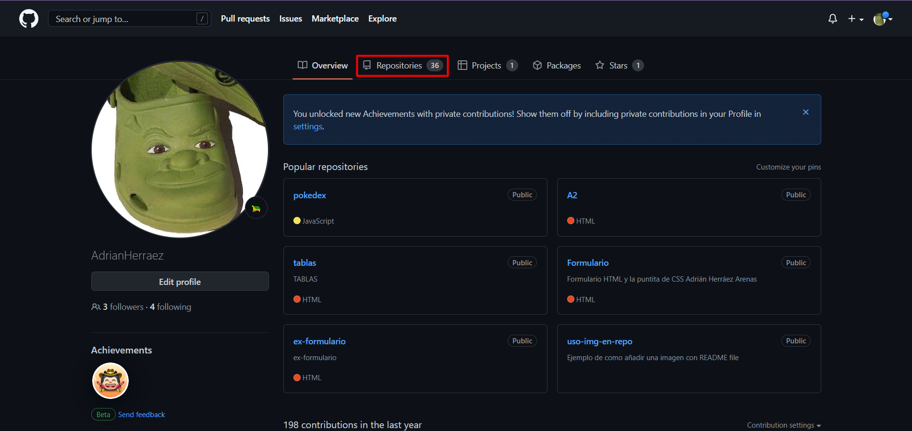
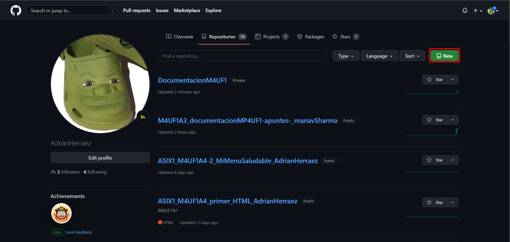
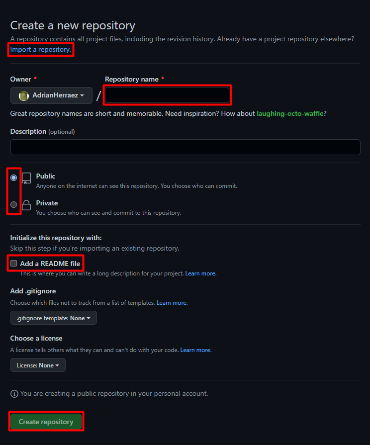
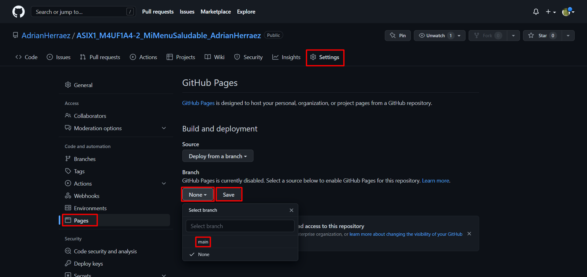
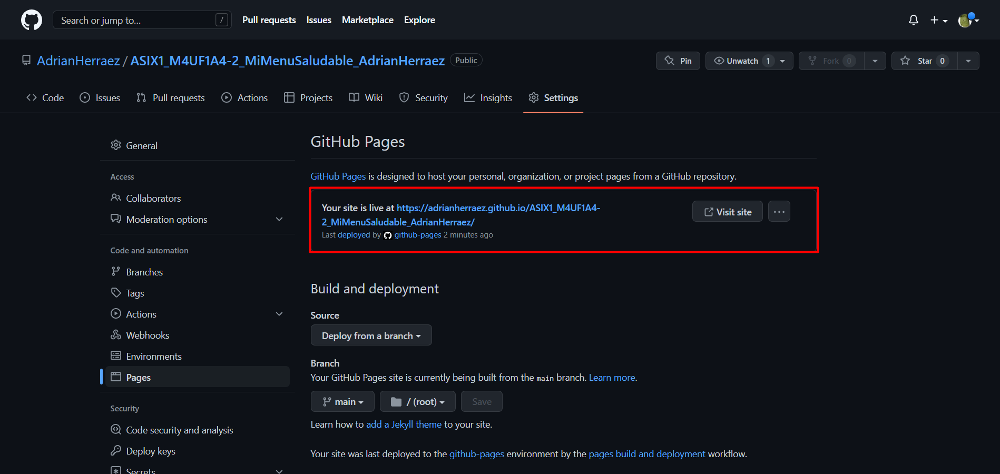
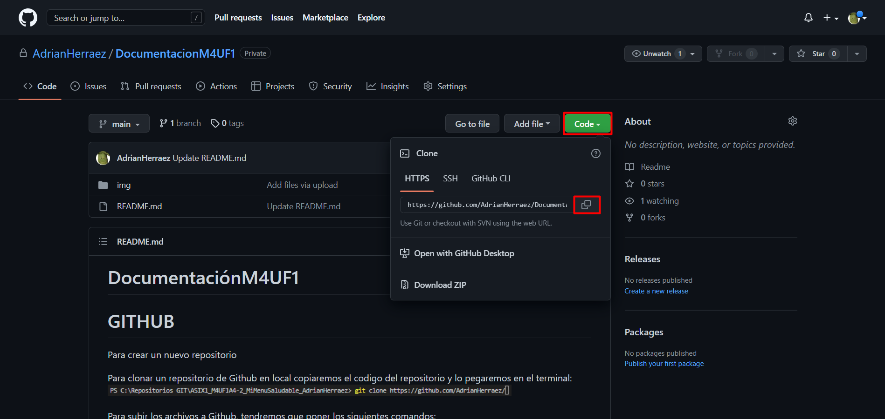


Para clonar un repositorio de Github en local copiaremos el codigo del repositorio y lo pegaremos en el terminal:  
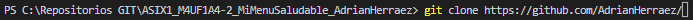

Para subir los archivos a Github, tendremos que poner los siguientes comandos:

- Selecciona lo que queremos subir, en este caso ponemos `.` para seleccionar todo  
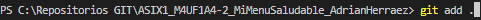

- Enviamos las actualizaciones que hemos hecho del repositorio `commit` y le damos un nombre a la version `-m`  
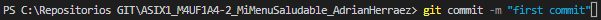

- Subimos el repositorio a Github
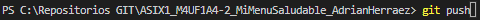


# MARKDOWN

## Estilos de letra:
Para cambiar los estilos en Markdown usaremos asteriscos `*` y guiones bajos `_` 
Estos estilos se pueden combinar  

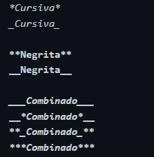

*Cursiva*

**Negrita**

***Combinado***

## Encabezados:
Para crear encabezados en Markdown usamos las almohadillas `#`, añadiendo 1 por cada nivel hasta un maximo de 6.  
Puedes cerrar los encabezados añadiendo el mismo numero de almohadillas al final.  
Los encabezados tienen un estilo asociado por defecto.

 # #Encabezado 1
 ## ##Encabezado 2
 ### ###Encabezado 3
 #### ####Encabezado 4
 ##### #####Encabezado 5
 ###### ######Encabezado 6

## Parrafos y Saltos de linea:
Para generar un nuevo párrafo en Markdown simplemente separa el texto mediante una línea en blanco (pulsando dos veces intro)

Markdown no soporta dobles líneas en blanco, así que si intentas generarlas estas se convertirán en una sola al procesarse.  
Para realizar un salto de línea y empezar una frase en una línea siguiente dentro del mismo párrafo, tendrás que pulsar dos veces la barra espaciadora antes de pulsar una vez intro.


## Listas:

### Listas ordenadas:
1. Para crear una lista ordenada usamos `numero.` Ej.: 1.
    1. Las listas se pueden anidar o combinar añadiendo 4 espacios antes del siguiente
5. El numero de la lista no es necesario que sea consecutivo ya que el numero cambia segun en la posición en la que se encuentre

### Listas desordenadas:
- Para crear una lista desordenada podemos usar: guion `-`, suma `+` o asterisco `*`
+ El simbolo usado para crear la lista no importa ya que todos se veran igual al procesarse
    * Estas listas tambien se pueden anidar o combinar

## Codigo
El codigo se tiene que introducir dentro de accentos graves '` `` `'.

`codigo`

Para crear un bloque que contenga codigo, este se ha de incluir entre tres accentos graves '` ``` `'.

```
codigo
```


# HTML

# CSS

# RESPONSIVE
